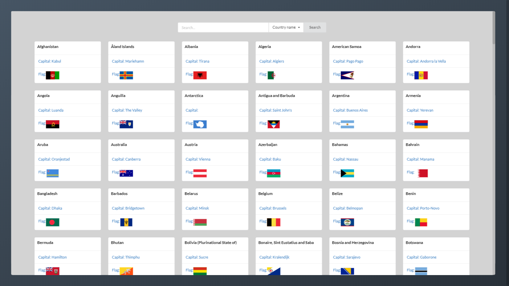
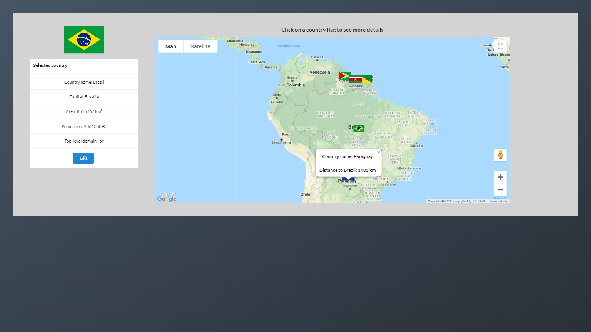
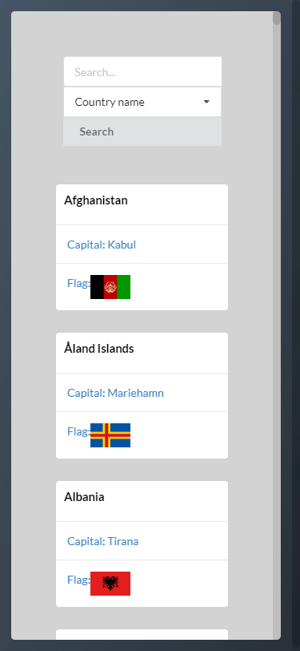
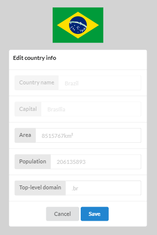

## Soft Countries

[Link para a aplicação](https://www.softcountries.com)

#### Screenshots da aplicação

  
  
 

  
  
 

## Proposta

> Criar um projeto utilizando React e a API Graph Countries
> ([https://github.com/lennertVanSever/graphcountries](https://github.com/lennertVanSever/graphcountries))
> seguindo as especificações abaixo.
> 
> Funcionalidades
> 
> - Lista de cards exibindo os países mostrando a bandeira, o nome e a capital; 
> - Ferramenta de busca de países; 
> - Página de detalhes do país com lista mais completa de informações (bandeira, nome, capital, área, população e top-level domain); 
> - Formulário para editar os dados de um país (salvando apenas no client-side);
> 
> Restrições técnicas:
> 
> - create-react-app  utilizado como base; 
> - react-router para trocar de página; 
> - @testing-library/react para testes;
> 
> Diferenciais:
> 
> - Criada uma pipeline no GitLab; (build => test => deploy); 
> - Projeto entregue publicado e funcionando (https://www.softcountries.com); 
> - 100% de cobertura no projeto com testes unitários; 
> - Redux substituído pelo Local state management do Apollo Client;
> - Na tela de detalhes do país, adicionado um mapa mostrando a distância entre o país e os 5 países mais próximos;

## Funcionalidades implementadas:
 - [x] Lista de cards mostrando bandeira, nome e capital
 - [x] Usuário pode buscar países (filtrando por nome ou capital)
 - [x] A lista possibilida que o usuário acesse uma página de detalhes de cada país
 - [x] Na tela de detalhes, são exibidas mais informações sobre o país selecionado: bandeira, nome capital, área, população e top-level domain
 - [x] Na tela de detalhes, o usuário pode editar dados de um país. Os dados são salvos no cache do navegador e persistem por toda a aplicação, mesmo após recarregar a página

## Requisitos técnicos atendidos:
 - [x] Crete-react-app utilizado como base
 - [x] Utilizado react-router para trocar de página

## Diferenciais:
 - [x] Pipeline criada no GitLab (build => test => deploy)
 - [x] Projeto entregue publicado e funcionando na URL: www.softcountries.com
 - [x] 100% de cobertura das funcionalidades garantida por testes unitários
 - [x] Redux substituído pelo Apollo Client

## Desafio Super Front:

 - [x] Na tela de detalhes do país, adicionado mapa que mostra mostrando a distância entre o país selecionado e os 5 países mais próximos;
